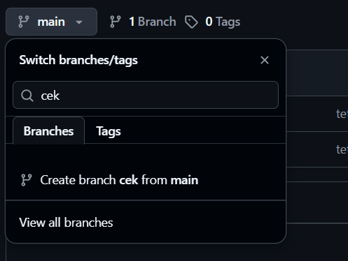
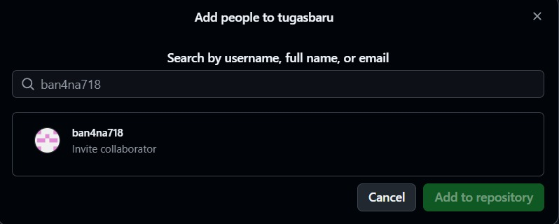
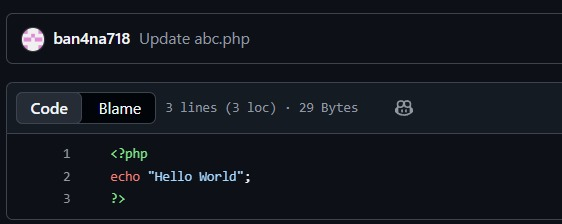
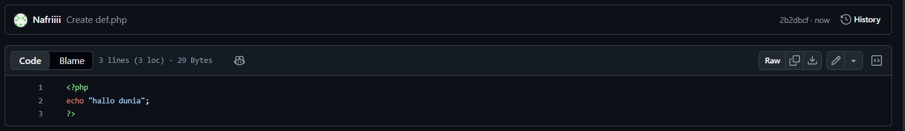
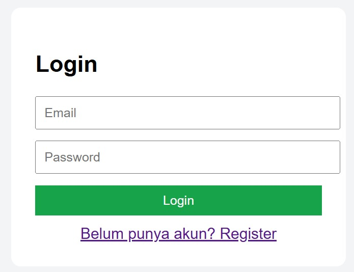
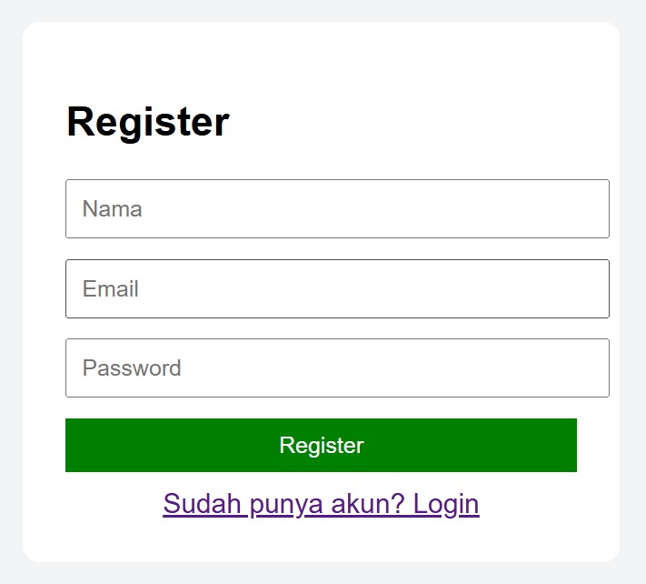
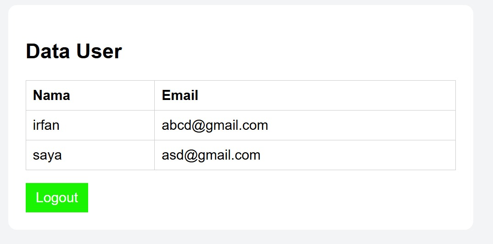
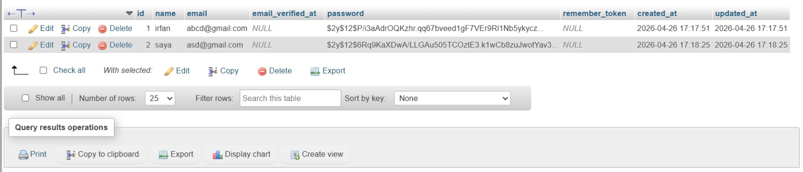

<h1 align="center">LAPORAN PRAKTIKUM</h1>
<h1 align="center">APLIKASI BERBASIS PLATFORM</h1>

 

<h2 align="center">LAPORAN PRAKTIKUM 7</h2>

  

  

<h2 align="center">Disusun Oleh :</h2>

  <b>Irfan Thoriq Habibi</b> 
  <b>2311102131</b> 
  <b>S1 Teknik Informatika - 2023</b>

 

<h2 align="center">Dosen Pengampu :</h2>

  <b>Cahyo Prihantoro, S.Kom., M.Eng</b>

  

<h1 align="center">LABORATORIUM HIGH PERFORMANCE</h1>
<h1 align="center">FAKULTAS INFORMATIKA</h1>
<h1 align="center">UNIVERSITAS TELKOM PURWOKERTO</h1>
<h1 align="center">TAHUN 2026</h1>

## 1. Dasar Teori

Git branch adalah fitur pada Git yang digunakan untuk membuat cabang terpisah dari kode utama dalam suatu project. Dengan adanya branch, seorang developer dapat mengerjakan fitur baru, melakukan perbaikan bug, atau melakukan eksperimen tanpa mengganggu kode utama yang biasanya berada pada branch main. Konsep ini memungkinkan setiap perubahan dilakukan secara terpisah sehingga lebih aman dan terstruktur. Misalnya, dalam pembuatan website, developer dapat membuat branch seperti fitur-login atau fitur-register untuk mengembangkan masing-masing fitur, kemudian setelah selesai dan diuji, perubahan tersebut dapat digabungkan kembali ke branch utama. Dengan demikian, git branch sangat membantu dalam kolaborasi tim, menjaga kestabilan project, serta mempermudah pengelolaan pengembangan perangkat lunak.

## 3. Tutorial Git Branch 

1. Buka repository yang ingin digunakan. lalu pilih main dan pilih create branch

  

2. lalu buka settings pada repository tersebut dan pilih collaborators dan masukkan username github teman yang akan diajak

  

3. Input * output dari ban4na718

  

Input * output dari nafriiii

  

## 4. Output WEB dengan Database Mysql 
- Tampilan Login
yang dimana terdapat 2 field untuk menginputkan email dan password dan ada button untuk login dan register.

  

- Tampilan Register
berisi field untuk menginputkan email,username,dan password

  

- Tampilan Dashboard
berisi semua username dan email yang sebelumnya sudah dibuat

  

- Tampilan Database Mysql
sebagaii tempat menyimpan data yang sudah dibuat sebelumnya

  

